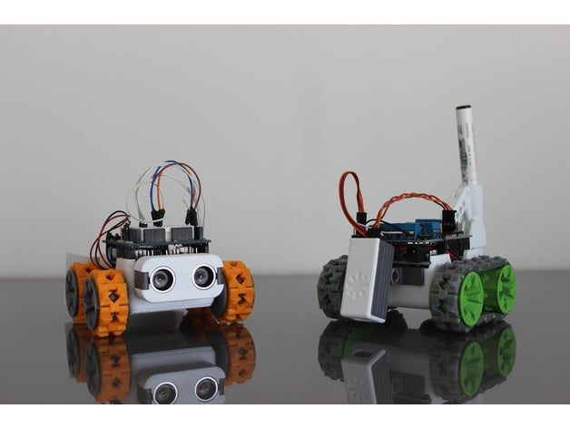
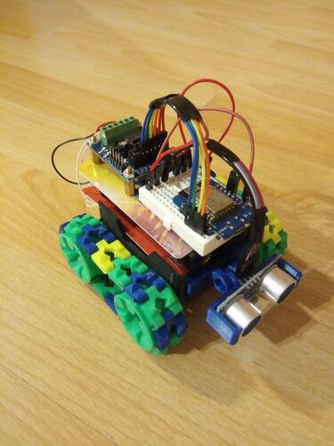

# SMARS

SMARS is a simple 3D printed robot designed for the educational field. This is the acronym of “Screwless/Screwed Modular Robotic System”.

This is how it is supposed to look like



And this is how it looks in my case :-)



### Resources

* [SMARS 3D files on Thingiverse](https://www.thingiverse.com/thing:2662828)


## SMARS, [WeMos](https://wiki.wemos.cc/products:d1:d1_mini), and [NodeMCU](https://github.com/nodemcu/nodemcu-firmware)

### Brief NodeMCU HOWTO
NodeMCU project provides an excellent [documentation](https://nodemcu.readthedocs.io), so no need to go into much details here. In brief, do the following steps to build and flash firmware image to WeMos D1 mini board:
* Get firmware source code
```bash
$ git clone https://github.com/nodemcu/nodemcu-firmware.git
```
* Customize NodeMCU firmware image
  Enable the following options in _app/include/user_modules.h_:
```bash
#define LUA_USE_MODULES_BIT
#define LUA_USE_MODULES_FILE
#define LUA_USE_MODULES_GPIO
#define LUA_USE_MODULES_GPIO_PULSE
#define LUA_USE_MODULES_MQTT
#define LUA_USE_MODULES_NET
#define LUA_USE_MODULES_NODE
#define LUA_USE_MODULES_PWM
#define LUA_USE_MODULES_SJSON
#define LUA_USE_MODULES_TMR
#define LUA_USE_MODULES_UART
#define LUA_USE_MODULES_WEBSOCKET
#define LUA_USE_MODULES_WIFI
```
* Build firmware
Build NodeMCU firmware:
```bash
$ make
```
* Flash firmware
Flash NodeMCU firmware to WeMos D1 mini board:
```bash
$ sudo ./tools/toolchains/esptool.py --port /dev/ttyUSB0 write_flash -fm dio -fs 32m 0x00000 bin/0x00000.bin 0x10000 bin/0x10000.bin
```

### TODO
